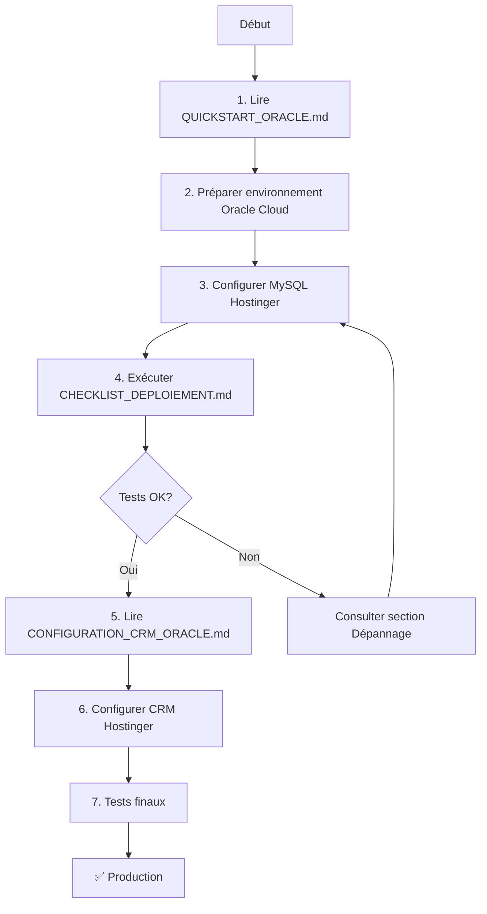

# 📚 Index des documentations - Déploiement Oracle Cloud + Hostinger

## 🎯 Vue d'ensemble

Ce projet déploie les **Agents IA CRM** sur **Oracle Cloud** avec connexion à une base de données **MySQL hébergée sur Hostinger**.

Architecture:
- **Oracle Cloud**: Héberge l'API FastAPI des agents IA (port 8000)
- **Hostinger**: Héberge le CRM PHP et la base de données MySQL (port 3306)
- **Communication**: Oracle ↔ Hostinger via réseau Internet (connexion MySQL distante)

---

## 📖 Documents disponibles

### 🚀 Guides de déploiement

| Document | Description | Public cible | Priorité |
|----------|-------------|--------------|----------|
| [QUICKSTART_ORACLE.md](QUICKSTART_ORACLE.md) | **Guide rapide en 3 étapes** pour déployer sur Oracle Cloud | DevOps, Admin système | 🔴 **PRIORITAIRE** |
| [DEPLOIEMENT_ORACLE_HOSTINGER.md](DEPLOIEMENT_ORACLE_HOSTINGER.md) | Guide complet et détaillé avec explications techniques | DevOps, Développeurs | 🟡 Référence |
| [CHECKLIST_DEPLOIEMENT.md](CHECKLIST_DEPLOIEMENT.md) | Checklist étape par étape à cocher pendant le déploiement | Admin système | 🔴 **ESSENTIEL** |

### 🔧 Configuration

| Document | Description | Public cible | Priorité |
|----------|-------------|--------------|----------|
| [CONFIGURATION_CRM_ORACLE.md](../CONFIGURATION_CRM_ORACLE.md) | Configuration du CRM Hostinger pour se connecter à Oracle | DevOps, Admin système | 🔴 **PRIORITAIRE** |
| [.env.production](.env.production) | Fichier de configuration de production (template) | DevOps | 🟡 Important |

### 🧪 Scripts et outils

| Fichier | Description | Usage | Type |
|---------|-------------|-------|------|
| [deploy-oracle.sh](deploy-oracle.sh) | Script de déploiement automatique sur Oracle Cloud | `./deploy-oracle.sh` | Bash |
| [test-mysql-hostinger.py](test-mysql-hostinger.py) | Test de connexion MySQL Hostinger depuis Oracle | `python3 test-mysql-hostinger.py` | Python |
| [test-oracle-api.php](../test-oracle-api.php) | Test de connexion CRM Hostinger → Oracle API | Via browser ou `php test-oracle-api.php` | PHP |

### 📝 Documentation héritée

| Document | Description | Relevance |
|----------|-------------|-----------|
| [DEPLOIEMENT_PRODUCTION.md](DEPLOIEMENT_PRODUCTION.md) | Guide de déploiement générique (avant Oracle) | ⚠️ Partiellement obsolète |
| [README.md](README.md) | Documentation générale du projet | ✅ Toujours valide |

---

## 🗺️ Parcours recommandé

### Pour un premier déploiement



**Étape par étape:**

1. **📖 Lecture préparatoire (15 min)**
   - [QUICKSTART_ORACLE.md](QUICKSTART_ORACLE.md) - Vue d'ensemble
   - [CHECKLIST_DEPLOIEMENT.md](CHECKLIST_DEPLOIEMENT.md) - Prérequis

2. **🔧 Préparation (30 min)**
   - Créer instance Oracle Cloud
   - Récupérer credentials MySQL Hostinger
   - Autoriser accès distant MySQL

3. **🚀 Déploiement Oracle (20 min)**
   - Transférer fichiers (`scp`)
   - Configurer `.env`
   - Lancer `./deploy-oracle.sh`

4. **🌐 Configuration CRM (15 min)**
   - Lire [CONFIGURATION_CRM_ORACLE.md](../CONFIGURATION_CRM_ORACLE.md)
   - Créer `.env` sur Hostinger
   - Modifier `AIAgentsClient.php`

5. **✅ Tests (10 min)**
   - Exécuter `test-mysql-hostinger.py` sur Oracle
   - Exécuter `test-oracle-api.php` sur Hostinger
   - Vérifier dashboard CRM

**Total: ~90 minutes**

---

## 📂 Structure des fichiers

```
crm/
├── ia/                                  # Dossier à déployer sur Oracle Cloud
│   ├── main.py                          # Application FastAPI
│   ├── agents/                          # Agents IA
│   ├── database.py                      # Connexion MySQL
│   ├── .env.production                  # Template config production
│   ├── requirements.txt                 # Dépendances Python
│   │
│   ├── deploy-oracle.sh                 # 🚀 Script de déploiement auto
│   ├── test-mysql-hostinger.py          # 🧪 Test connexion MySQL
│   │
│   ├── QUICKSTART_ORACLE.md             # 📖 Guide rapide (COMMENCER ICI)
│   ├── DEPLOIEMENT_ORACLE_HOSTINGER.md  # 📖 Guide complet
│   ├── CHECKLIST_DEPLOIEMENT.md         # ✅ Checklist
│   └── INDEX_DOCUMENTATION.md           # 📚 Ce fichier
│
├── test-oracle-api.php                  # 🧪 Test API depuis Hostinger
├── CONFIGURATION_CRM_ORACLE.md          # 🔧 Config CRM
│
├── api/
│   └── AIAgentsClient.php               # Client PHP pour API
│
└── .env                                 # Config CRM (à créer)
```

---

## 🎯 Cas d'usage

### Je veux déployer pour la première fois
👉 Commencez par [QUICKSTART_ORACLE.md](QUICKSTART_ORACLE.md)
👉 Suivez [CHECKLIST_DEPLOIEMENT.md](CHECKLIST_DEPLOIEMENT.md)

### J'ai un problème de connexion MySQL
👉 Exécutez [test-mysql-hostinger.py](test-mysql-hostinger.py)
👉 Consultez la section "Dépannage" de [DEPLOIEMENT_ORACLE_HOSTINGER.md](DEPLOIEMENT_ORACLE_HOSTINGER.md)

### Le CRM ne se connecte pas à l'API Oracle
👉 Exécutez [test-oracle-api.php](../test-oracle-api.php)
👉 Vérifiez [CONFIGURATION_CRM_ORACLE.md](../CONFIGURATION_CRM_ORACLE.md)

### Je veux comprendre l'architecture en détail
👉 Lisez [DEPLOIEMENT_ORACLE_HOSTINGER.md](DEPLOIEMENT_ORACLE_HOSTINGER.md)

### Je dois mettre à jour le code sur Oracle
```bash
# Sur votre Mac
cd /Applications/MAMP/htdocs/PP/webitech/WEB/crm
tar -czf agents-ia-update.tar.gz ia/

# Envoyer sur Oracle
scp agents-ia-update.tar.gz opc@VOTRE_IP:~

# Sur Oracle
ssh opc@VOTRE_IP
cd /var/www/agents-ia
sudo tar -xzf ~/agents-ia-update.tar.gz --strip-components=1
sudo systemctl restart agents-ia
```

### Je veux changer la clé API
1. Sur Oracle: éditer `/var/www/agents-ia/.env` → `API_SECRET_KEY`
2. Sur Hostinger: éditer `crm/.env` → `AI_API_KEY`
3. Redémarrer: `sudo systemctl restart agents-ia`
4. Tester: `curl -H "X-API-Key: NOUVELLE_CLE" http://IP:8000/health`

---

## 🔍 Recherche rapide

### Commandes utiles

**Sur Oracle Cloud:**
```bash
# Statut du service
sudo systemctl status agents-ia

# Logs temps réel
sudo journalctl -u agents-ia -f

# Logs applicatifs
tail -f /var/log/crm-ai/api.log
tail -f /var/log/crm-ai/api-error.log

# Redémarrer
sudo systemctl restart agents-ia

# Tester localement
curl http://localhost:8000/health
```

**Sur Hostinger (via SSH):**
```bash
# Vérifier config
cat ~/public_html/crm/.env

# Tester API Oracle
curl http://VOTRE_IP_ORACLE:8000/health

# Tester depuis PHP
php ~/public_html/crm/test-oracle-api.php
```

**Depuis votre Mac:**
```bash
# Tester API Oracle
curl http://VOTRE_IP_ORACLE:8000/health

# Tester authentification
curl -H "X-API-Key: VOTRE_CLE" \
     http://VOTRE_IP_ORACLE:8000/api/inbox/pending-actions
```

---

## 📊 Matrice de décision

| Question | Oui | Non |
|----------|-----|-----|
| C'est mon premier déploiement ? | [QUICKSTART_ORACLE.md](QUICKSTART_ORACLE.md) | [CHECKLIST_DEPLOIEMENT.md](CHECKLIST_DEPLOIEMENT.md) (section MAJ) |
| Je veux comprendre en profondeur ? | [DEPLOIEMENT_ORACLE_HOSTINGER.md](DEPLOIEMENT_ORACLE_HOSTINGER.md) | [QUICKSTART_ORACLE.md](QUICKSTART_ORACLE.md) suffit |
| J'ai un problème ? | Voir section Dépannage ci-dessous | Continue normal |
| Je veux automatiser ? | Utilise [deploy-oracle.sh](deploy-oracle.sh) | Déploiement manuel OK |
| Production critique ? | Lis TOUT + tests exhaustifs | QUICKSTART + CHECKLIST OK |

---

## 🆘 Dépannage rapide

| Symptôme | Diagnostic | Solution |
|----------|-----------|----------|
| `Connection refused` (Oracle) | Service arrêté ou port fermé | `sudo systemctl restart agents-ia` + check firewall |
| `401 Unauthorized` | Mauvaise API key | Vérifier identique dans Oracle/.env et Hostinger/.env |
| `Can't connect to MySQL` | Accès distant non autorisé | cPanel Hostinger → Accès distant MySQL → Add IP |
| `Unknown column` | Schema BDD incorrect | Vérifier noms colonnes: `mailbox`, `sent_at`, etc. |
| `Timeout` | Latence réseau élevée | Vérifier `ping`, augmenter TIMEOUT dans config |

**En cas de blocage:**

1. Vérifier les logs: `sudo journalctl -u agents-ia -n 100`
2. Exécuter les tests: `test-mysql-hostinger.py` et `test-oracle-api.php`
3. Consulter [DEPLOIEMENT_ORACLE_HOSTINGER.md](DEPLOIEMENT_ORACLE_HOSTINGER.md) section Dépannage
4. Vérifier [CHECKLIST_DEPLOIEMENT.md](CHECKLIST_DEPLOIEMENT.md) pour étapes manquées

---

## 🔗 Liens externes

- [Oracle Cloud Console](https://cloud.oracle.com/) - Gestion infrastructure
- [Hostinger cPanel](https://hpanel.hostinger.com/) - Gestion MySQL et fichiers
- [FastAPI Docs](https://fastapi.tiangolo.com/) - Documentation FastAPI
- [Systemd Guide](https://www.freedesktop.org/software/systemd/man/systemd.service.html) - Services Linux

---

## 📞 Contact & Support

**Responsable projet:** _________________

**Date dernière MAJ:** $(date +%Y-%m-%d)

**Version:** 1.0.0

---

## ✨ Prochaines améliorations

- [ ] Ajouter HTTPS avec Nginx reverse proxy
- [ ] Configurer monitoring (Prometheus/Grafana)
- [ ] Automatiser backup base de données
- [ ] CI/CD avec GitHub Actions
- [ ] Load balancer pour haute disponibilité

---

**Bon déploiement ! 🚀**
